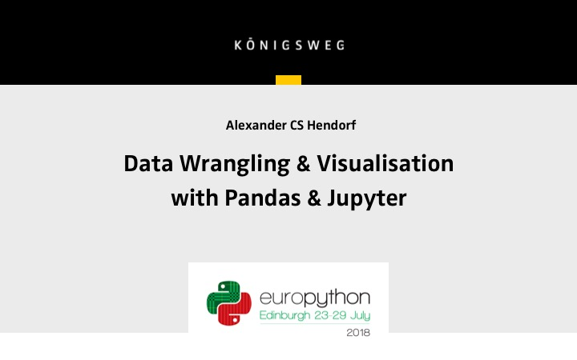

# Data Wrangling & Visualisation with Pandas & Jupyter

## Follow-Along tutorial presented at PyData conferences all over Europe.



Pandas is the Swiss-Multipurpose Knife for Data Analysis in Python. With Pandas dealing with data-analysis is easy and simple but there are some things you need to get your head around first as Data-Frames and Data-Series. 

The tutorial provides a compact introduction to Pandas for beginners for I/O, data visualisation, statistical data analysis and aggregation within Jupiter notebooks.

### Installation

Copy this repository to your computer
```
# get this repository
git clone https://github.com/alanderex/pydata-pandas-workshop.git
cd pydata-pandas-workshop
```

Having [Anaconda](https://www.continuum.io/downloads) installed simply create your ENV with 

```
# install working environment with conda
conda env create -n pydata-pandas-workshop -f environment.yml

# environment should be activated now
# if not type: source activate pydata-pandas-workshop

# start juypter lab
jupyter lab

# paste the url displayed in your browser, if it doesn't open anyway:
# http://localhost:8888/lab
```  
Alternatively you can also [create a python virtual enviroment](https://uoa-eresearch.github.io/eresearch-cookbook/recipe/2014/11/26/python-virtual-env/) and 
```
pip install -r requirements.txt
```


If you don't want to use anaconda, you can use python3 and 
``` 
pip install pandas jupyter barnum numpy matplotlib xlsxwriter seaborn bokeh jupyter parquet dask
``` 
(at your own risk)


#### A Practical Start: Reading and Writing Data Across Multiple Formats 

* CSV
* Excel
* JSON
* Clipboard
 
* data
    * .info
    * .describe

#### DataSeries & DataFrames / NumPy

* Ode to NumPy
* Data-Series
* Data-Frames

#### Data selection & Indexing

* Data-Series: 
    * Slicing
    * Access by label
    * Index
* Data-Frames: 
    * Slicing
    * Access by label
    * Peek into joining data
* Returns a copy / inplace
* Boolean indexing

#### Operations
    
 * add/substract
 * multiply

#### Data Visualisation

 * plot your data directly into your notebook

#### Peek Into Statistical Data Analysis & Aggregation

  * Merging
  * Multi-Index
  * DateTime Index
  * Resampling
  * Pivoting

#### Scaling and Optimizing

  * Faster file I/O with Parquet
  * Scaling and Distributing with Dask


